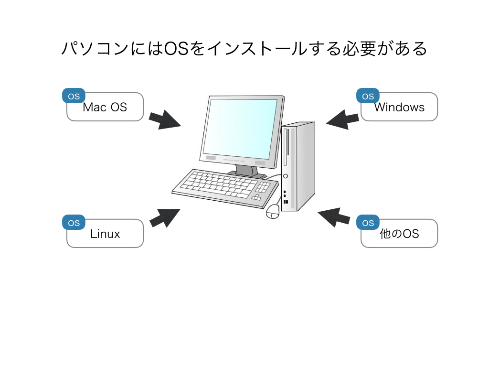
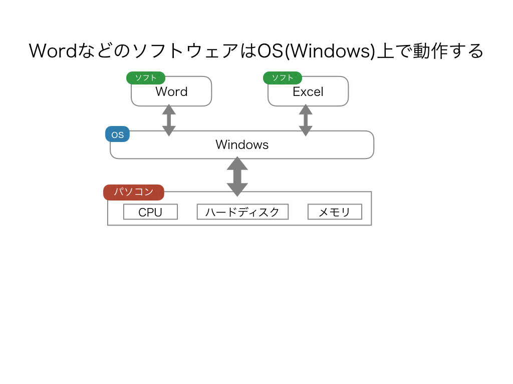
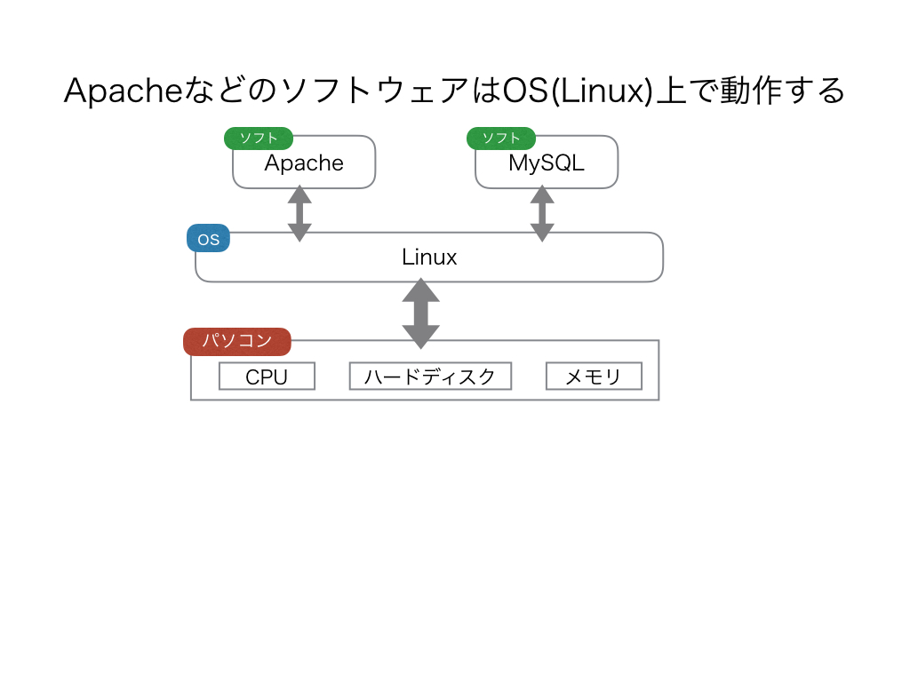

# Linuxとは

## OSとOSの仕組み
- OSとは Operating System(オペレーティング・システム) の略。
- 例えば、WindowsやMacOSもOSの1種であり、Linuxもその中の1つ。
- OSという、パソコンの基本ソフトウェアをパソコンにインストールすることで、様々ソフトウェアが使えるようになるし、インターネットもできるようになる。
- 世界で一番シェアがあるのはWindows。

### WindowsでWordやExcelを使っているとき
例えば、Microsoft社のWordやExcelというソフトウェアは、WindowsというOSの上で動作している。これらのソフトウェアはあくまで「OS上で」動作しています。なので、ソフトウェア(例:Word)は、OS(例:Windows)がないと動作しない。

### Linuxの場合
Linuxの場合でも、構造は同じです。例えば、ApacheやMySQLなどといったソフトウェアはOS(Linux)がないと動作しない。 
※「Apache」や「MySQL」はここでは解説しませんが、両者とも非常によく使われているソフトウェアです。

## ここまでのまとめ
- OSとはOperatingSystemのこと。
- ソフトウェアはOSがないと動作しない。
- OSの種類としては、Windows、MacOS、Linuxなどがある。

## Linuxの誕生と特長
- リーナス・トーバルズさんが学生時代に作ったOS。
- 1991年9月にバージョン0.01として公開された。
- ソースコードが一般に無料で公開されている(オープンソース)、だれでも自由かつ無償で利用できる(※Windowsはオープンソースではない！)。
- 品質の高いソフトウェア(WebサーバのApache、データベースシステムのMySQLなど)が利用できる。

## Linuxはどこで使われているのか？
私たちが普段利用している色々なWebサービスも、Linuxがよく使われています。 
Webサービスを作るためには、Webブラウザからのリクエストを受け付けるWebサーバや、処理内容を記録するデータベースサーバなどが必要ですが、これらのサーバのOS環境でLinuxを使うのが現代では極めてポピュラーで基本的な構成です。 
よって、Webに関わる仕事をする上でLinuxの基礎知識は欠かせません。 
※各種サーバなどについてはここでは解説しませんが、基本的なものは全てCloud9に用意されています。Cloud9は便利ですね。 

# ディストリビューションとは
## LinuxとはLinuxカーネルのこと
ここまで「Linux」という言葉を使ってきましたが、本来「Linux」という言葉が指し示すのは「Linuxカーネル(※)」です。LinuxカーネルとはOSの中核となる部分であり、カーネルがコンピュータの制御を行うソフトウェアのみを指します。
なので、実際に私たちユーザが使うツールやアプリケーションは、狭義にはLinuxに含まれません。 
※「カーネルとは何か？」ということ自体は本質的な問題ではないので、軽く流して置きましょう

## ディストリビューションとは広義のLinux
Linuxとは狭義にはLinuxカーネルを指すわけですが、あくまでLinuxカーネルはOSの核を担っているだけで、これだけでは不便です。他に必要なものを入れないとコンピュータでアレコレできません。 
特に初心者にとっては、Linuxカーネル以外の必要なソフトウェアをインストールするのは大変な作業になります。 
しかし、もし、Linuxカーネルと基本的なアプリケーションなどをパッケージとしてまとめられていれば非常に助かります。 
このように、「Linuxカーネルに加えて、基本的なコマンド群やアプリケーションなどを含めて、ユーザがそのまま利用できるようにパッケージされたもの」を「ディストリビューション(
Distribution)」と呼びます。 

現在、一般的にLinuxと言えば、この広義の意味を指すので、以降は単に「Linux」と書いた場合はツールやアプリケーション群を含んだ「Linuxディストリビューション」を表すこととします。明示的に狭義のLinuxを示す場合は「Linuxカーネル」と記述します。 

※Linuxカーネル以外に必要なものとしては、「ライブラリ」「デバイスドライバ」「アプリケーションソフトウェア」「GUI環境」などがあります。 
※Distributionは配布という意味です。 

## ディストリビューションの種類
ディストリビューションは、RedHat系とDebian系の2種類に大別されます。 
各ディストリビューションの具体的な違いについては詳しくは述べませんが、ディストリビューションによってコマンドが違ったりするので調べる場合には気をつけましょう。Cloud9はUbuntuです。 

| 名称 | 系統 | 概要 |
|:------:|:------:|:------:|
| RedHat Enterprise Linux(RHEL) | RedHat系 | RedHay社の商用製品。企業の業務用で使われるなどシェアが多い。|
| CentOS | RedHat系 | RedHat Enterprise Linux をベースとしたもの。中身はほぼ同一で無償で利用できる。|
| Fedora | RedHat系 | FedoraはRed Hat社の支援を受けたプロジェクトによって開発が進められている実験的な要素の強いディストリビューションです。Fedoraの試験運用で得られた成果はRed Hat Enterprise Linux(RHEL)に還元されるという仕組みです。|
| Debian GNU/Linux | Debian系 | Debianプロジェクトで開発が行われている。|
| Ubuntu | Debian系 | Debian GNU/Linuxベースで開発されているもの。無償で利用できる。|

## Linuxを学ぶにあたって
Linuxの概観をなんとなく掴んだら(まだイマイチ掴めてなくても大丈夫！)、しばらくはコマンドラインでの操作を覚えていくことになります。 
より具体的には、ターミナルにひたすらコマンドを打ち込んでは結果を確認するという流れになります。