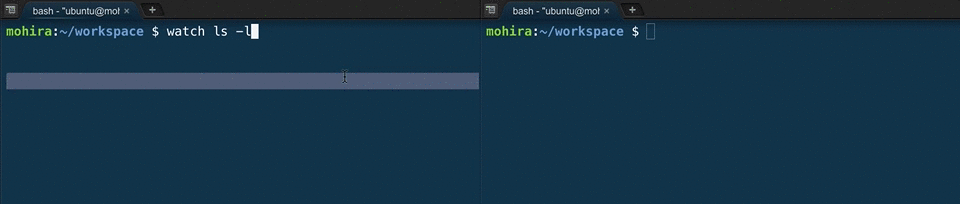

# お役立ちコマンドなど

## はじめに
便利なコマンドやテクニックを紹介します。特にテクニックに関しては確実に覚えてください。

- Tabによる入力補完
- コマンド履歴(↑キー / history / Control + r)
- 画面リセット(Control + l / clear)
- カレンダー(cal)
- マニュアル表示(man)
- エイリアス表示(alias)
- 自ユーザー表示(whoami)
- 継続実行(watch)

# 【WIP】あとで確認
- zshでテトリスをやろう
- slコマンドで汽車を走らせよう
- コマンドによるカーソル移動


## Tabによる入力補完
Tabキーを利用するとパスの入力補完ができます。Tabキーを押してパス名が一意に定まる場合はそのパス名を表示し、複数の候補がある場合はその候補軍を表示してくれます。これにより長いパスになっても素早くかつミスを抑えて入力することができます。

```bash
$ ls /e     # ←ここでTabキーを入力
$ ls /etc/  # ←このように補完される
$ ls /etc/b # ←ここでTabキーを入力(2回)
bash.bashrc             blkid.conf
bash_completion         blkid.tab
bash_completion.d/      bonobo-activation/
bindresvport.blacklist
```

## コマンド履歴(↑キー / history / Control + r)
過去に入力したコマンドを確認したい場合や、再度実行したい場合、一部コマンドをミスしたので部分的に編集してから実行したい場合にテクニックを紹介します。<br>

### ↑キー_過去の入力を遡る
過去に入力したコマンドを最新から順に表示してくれます(↑キーを押すほど古いコマンド)。近くに実行したコマンドを遡ったり、一部修正したりするときに便利です。<br>

### history_過去のコマンド一覧
過去に実行したコマンドを一覧できるコマンドです。
`!<数字>`とすると、コマンドの左側に表示されている番号を基にコマンドを呼び出すこともできます。<br>

```bash
$ history
    1  cat
    2  ls
    3  touch test.txt
    4  cat test.txt
    5  history
$ !2
ls
README.md  test.txt
``

### Control + r_コマンド履歴の検索(リバースサーチ)
上記テクニックを利用すれば、過去のコマンドを遡ったり、再実行することができるようになります。しかし、実行したコマンドの数が増えていくといちいち↑キーやhistoryから辿るのは困難になります。そこで便利なのがリバースサーチ(「Control + r」)です。<br>
例えば、`rails s -b $IP -p $PORT`(Cloud9上でRailsのサーバーを起動するコマンド)で試してみましょう。このコマンドは良く使いますが、入力がなかなか面倒です。さらにRailsにおいては、コマンドラインを多用するので、埋もれがちです。そこで「Control + r」が役立ちます。<br>
「Control + r」を入力すると下記のようになります。<br>

```bash
(reverse-i-search)`':
```

ここで「r」を1文字入力してみましょう。<br>

```bash
(reverse-i-search)`r': rails s -b $IP -p $PORT
```

そのままEnterを押せばコマンドを実行できます。<br>
Escを押せば、検索結果を表示したままコマンドラインに戻ります。<br>

Railsで開発を行っている場合、「rails」コマンドを多用するので、「r」だけではサーバー起動コマンドの補完は厳しいと思われるので、そのときは「PO」や「$」などが効果的でしょう。<br>
慣れないと使いにくいですが、リバースサーチはとても強力なので積極的に使ってみましょう。<br>

## 画面リセット(Control + l / clear)
コマンドラインで入力を続けていると、見た目がごちゃごちゃしてしまいます。その状況で「cat」や「ls」などをすると、どれが自分のみたい内容だったかが分かりにくくなる場合もあります。そこで「画面リセット」してスッキリさせましょう。<br>
下記のようになっているときもclaerコマンドできれいになります。<br>

### clearする前
```bash
$
$
$
$
$
$
$
$
$
$
$
$
$
$
$
$
$
$
$
$
$
$
$ clear
```

### clearした後

```bash
$
```

### clearコマンドは 「Control + l」 で代用可能
いちいち`clear`を入力しなくても「Control + l」で同様の効果が得られます。<br>

## カレンダー(cal)
calコマンドでカレンダーを表示することができます。現在の日付だけでなく、特定の年のカレンダーを表示することもできます。曜日も一覧できるので便利です。<br>

```bash
$ cal
    October 2016
Su Mo Tu We Th Fr Sa
                   1
 2  3  4  5  6  7  8
 9 10 11 12 13 14 15
16 17 18 19 20 21 22
23 24 25 26 27 28 29
30 31
$ cal 2016 # 年を指定することもできる
                            2016
      January               February               March
Su Mo Tu We Th Fr Sa  Su Mo Tu We Th Fr Sa  Su Mo Tu We Th Fr Sa
                1  2      1  2  3  4  5  6         1  2  3  4  5
 3  4  5  6  7  8  9   7  8  9 10 11 12 13   6  7  8  9 10 11 12
10 11 12 13 14 15 16  14 15 16 17 18 19 20  13 14 15 16 17 18 19
17 18 19 20 21 22 23  21 22 23 24 25 26 27  20 21 22 23 24 25 26
24 25 26 27 28 29 30  28 29                 27 28 29 30 31
31

       April                  May                   June
Su Mo Tu We Th Fr Sa  Su Mo Tu We Th Fr Sa  Su Mo Tu We Th Fr Sa
                1  2   1  2  3  4  5  6  7            1  2  3  4
 3  4  5  6  7  8  9   8  9 10 11 12 13 14   5  6  7  8  9 10 11
10 11 12 13 14 15 16  15 16 17 18 19 20 21  12 13 14 15 16 17 18
17 18 19 20 21 22 23  22 23 24 25 26 27 28  19 20 21 22 23 24 25
24 25 26 27 28 29 30  29 30 31              26 27 28 29 30


        July                 August              September
Su Mo Tu We Th Fr Sa  Su Mo Tu We Th Fr Sa  Su Mo Tu We Th Fr Sa
                1  2      1  2  3  4  5  6               1  2  3
 3  4  5  6  7  8  9   7  8  9 10 11 12 13   4  5  6  7  8  9 10
10 11 12 13 14 15 16  14 15 16 17 18 19 20  11 12 13 14 15 16 17
17 18 19 20 21 22 23  21 22 23 24 25 26 27  18 19 20 21 22 23 24
24 25 26 27 28 29 30  28 29 30 31           25 26 27 28 29 30
31

      October               November              December
Su Mo Tu We Th Fr Sa  Su Mo Tu We Th Fr Sa  Su Mo Tu We Th Fr Sa
                   1         1  2  3  4  5               1  2  3
 2  3  4  5  6  7  8   6  7  8  9 10 11 12   4  5  6  7  8  9 10
 9 10 11 12 13 14 15  13 14 15 16 17 18 19  11 12 13 14 15 16 17
16 17 18 19 20 21 22  20 21 22 23 24 25 26  18 19 20 21 22 23 24
23 24 25 26 27 28 29  27 28 29 30           25 26 27 28 29 30 31
30 31
`

## マニュアル表示(man)
manは指定したコマンドのマニュアルを表示するコマンドです。基本的な使い方やオプションなどを表示することができます。スクロールや終了については、基本的にはlessコマンド実行時と同一です。<br>
下記はcatコマンドの使い方を表示しています。<br>

```bash
$ man cat

CAT(1)                                               User Commands                                               CAT(1)

NAME
       cat - concatenate files and print on the standard output

SYNOPSIS
       cat [OPTION]... [FILE]...

DESCRIPTION
       Concatenate FILE(s), or standard input, to standard output.

       -A, --show-all
              equivalent to -vET

       -b, --number-nonblank
              number nonempty output lines, overrides -n

       -e     equivalent to -vE

       -E, --show-ends
              display $ at end of each line

       -n, --number
              number all output lines

       -s, --squeeze-blank
              suppress repeated empty output lines

       -t     equivalent to -vT

       -T, --show-tabs
              display TAB characters as ^I

       -u     (ignored)

       -v, --show-nonprinting
              use ^ and M- notation, except for LFD and TAB

       --help display this help and exit

       --version
              output version information and exit

       With no FILE, or when FILE is -, read standard input.

EXAMPLES
       cat f - g
              Output f's contents, then standard input, then g's contents.

       cat    Copy standard input to standard output.

CAT(1)                                               User Commands                                               CAT(1)

NAME
       cat - concatenate files and print on the standard output

SYNOPSIS
CAT(1)                                               User Commands                                               CAT(1)

NAME
       cat - concatenate files and print on the standard output

SYNOPSIS
CAT(1)                                               User Commands                                               CAT(1)

NAME
       cat - concatenate files and print on the standard output

SYNOPSIS
       cat [OPTION]... [FILE]...

DESCRIPTION
       Concatenate FILE(s), or standard input, to standard output.

       -A, --show-all
              equivalent to -vET

       -b, --number-nonblank
              number nonempty output lines, overrides -n

       -e     equivalent to -vE

       -E, --show-ends
              display $ at end of each line

       -n, --number
              number all output lines

       -s, --squeeze-blank
              suppress repeated empty output lines

       -t     equivalent to -vT

       -T, --show-tabs
              display TAB characters as ^I

       -u     (ignored)

       -v, --show-nonprinting
              use ^ and M- notation, except for LFD and TAB

       --help display this help and exit

       --version
              output version information and exit

       With no FILE, or when FILE is -, read standard input.

EXAMPLES
       cat f - g
              Output f's contents, then standard input, then g's contents.

       cat    Copy standard input to standard output.
```

## エイリアス表示(alias)
よく使うコマンドに別名を付けて、素早く実行することができます。

### aliasコマンドの構文

### 実際に使ってみる
`ls -l`を`ll`、`ls -a`を`la`で入力できるようにします。<br>

```bash
$ alias ll='ls -l'
$ ll
total 0
-rw-r--r-- 1 ubuntu ubuntu 0 Oct  9 19:05 README.md
$ alias la='ls -a'
$ la
.  ..  .c9  README.md
```

### aliasの確認
`type <コマンド名>`でそのコマンドを確認できます。<br>
`alias`を使うと、全てのaliasを確認できます。`ll`と`la`以外のコマンドをCloud9のデフォルトのaliasです。<br>

```bash
$ type ll # ll のalias設定確認
ll is aliased to `ls -l'
$ type la # la のalias設定確認
la is aliased to `ls -a'
$ alias
alias ..='cd ..'
alias egrep='egrep --color=auto'
alias fgrep='fgrep --color=auto'
alias grep='grep --color=auto'
alias l='ls -CF'
alias la='ls -a'
alias less='less -R '
alias ll='ls -l'
alias mysqldump='mysqldump --user=mohira --host=0.0.0.0'
alias php='php -c ~/workspace/php.ini'
alias rvm-restart='rvm_reload_flag=1 source '\''/usr/local/rvm/scripts/rvm'\'''
```

### aliasの削除
```bash
$ unalias ll
$ unalias la
$ type la
bash: type: la: not found
$ unalias ll
bash: unalias: ll: not found
```

## 自ユーザー表示(whoami)
`whoami`を使うと現在のユーザ名を表示できます。<br>

```bash
$ whoami
ubuntu
```
## 継続実行(watch)
`watch`コマンドを使うと、あるコマンドを一定の時間ごとに実行して結果を端末にスクロールさせずに固定で表示することができます。ログファイルの監視などで使います。<br>
gif画像でその動きを確認してみましょう。下記の画像は、watchで監視モードに入っている状態で、「README.mdの削除」と「sample.txt作成」を行っています。<br>



