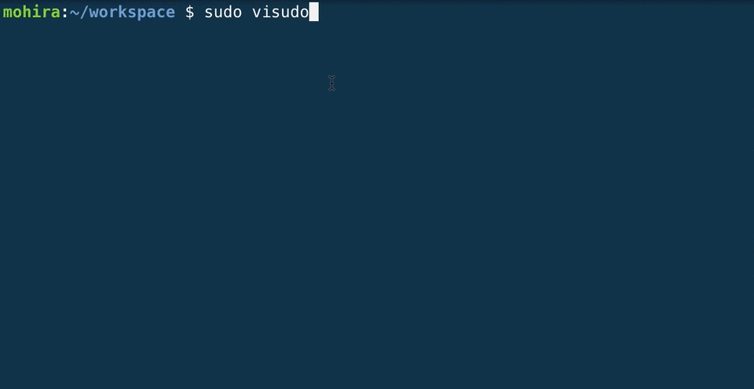
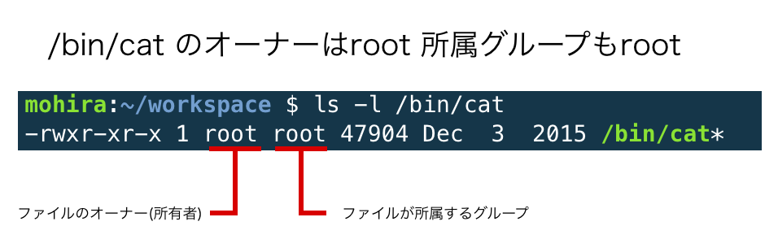
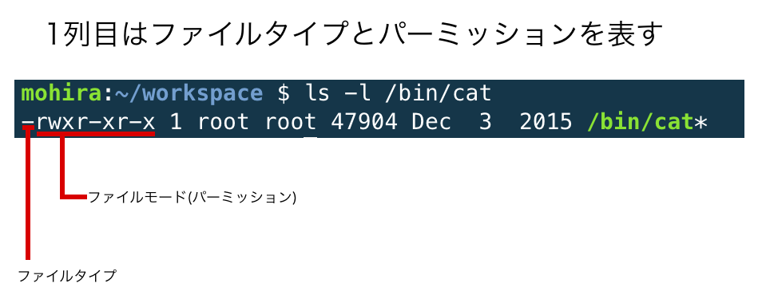
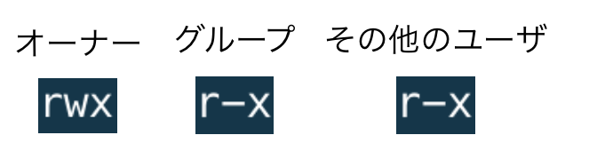
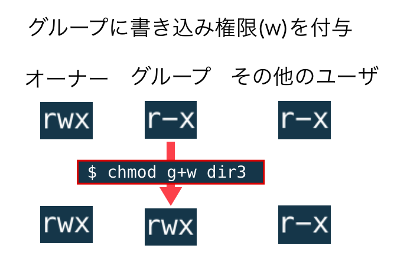
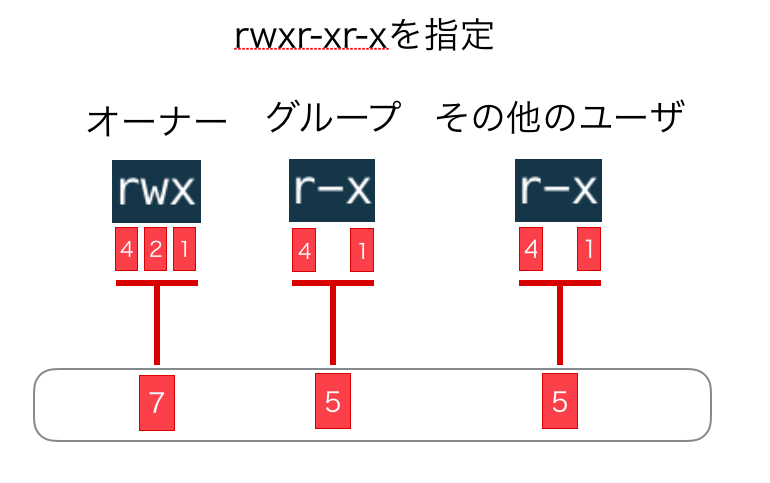

# ユーザとグループ

## はじめに
ユーザとグループについて学習します。

## 【WIP】残り項目
- [済]root ユーザーの利用
- [済]グループ概要
- [済]ユーザーとグループの管理
- [済]ユーザーのパスワード変更
- [済]ユーザー変更
- [済]ファイルの所有者と所有グループ
- [済]所有者と所有グループの変更
- [済]ファイルとディレクトリのアクセス権
- [済]パーミッションの変更

## 【WIP】残りコマンド
- [済]id
- [済]useradd -> adduser
- [済]userdel -> deluser
- [未]passwd
- [済]groupadd -> addgroup
- [済]groupdel -> delgroup
- [済]sudo
- [済]/etc/passwd
- [済]/etc/group
- [済]ls -l
- [済]chown
- [済]chmod
- [済]umask
- [済]visudo

## 前置き
Linuxは、1つのマシンへ複数のユーザが同時にログインして操作することを前提として作られています。ということは、秘密にしておきたいファイルを他のユーザに見られてしまっては困ってしまいますし、意図せず他のユーザのファイルを書き換えてしまうことを防ぐ必要もあります。そういったファイル保護を実現するためのアクセス権限や各種ユーザについて解説します。

## ユーザの種類
Linuxにおけるユーザは、「rootユーザ」「一般ユーザ」「システムアカウント」の3種類に区別されます。概要は下記の表のとおりです。<br>

| 種類 | 意味 |
|:-----:|:-----:|
| rootユーザ(システム管理者/スーパーユーザ) |システムに対してすべての権限を持つアカウント |
| 一般ユーザ | システムを利用する側の人やアカウントで使えるコマンドに制限がある |
| システムアカウント | システム内部で特定のアプリケーションを動かす専用のアカウント |


### rootユーザ
システム管理者用のアカウントです。「rootユーザ」や「root」、「スーパーユーザ」などと呼ばれます。rootユーザはあらゆる操作が許可された強い権限を持つユーザであり、システムの設定ファイルの変更や、新しいアプリケーションをインストールしたりすることが可能です。<br>
ファイルの権限設定の影響を受けずに全てのファイル操作ができてしまうので、**通常は一般ユーザとして操作し、必要なときだけrootユーザとして作業する**というように、利用を最小限に留めることが重要です。<br>


## sudoコマンド_コマンドをrootユーザとして実行する
**通常は一般ユーザとして操作し、必要なときだけrootユーザとして作業する**ためにはsudoコマンドを利用します。下記の例では、`/etc/shadow'というコマンドは実行できませんが、sudoをつけることによって実行することができています。<br>
※sudoを付けた場合、パスワードが要求されるのが一般的ですが、Cloud9の場合はパスワードを入力せずに実行できます。

```bash
$ cat /etc/shadow
cat: /etc/shadow: Permission denied
$ sudo cat /etc/shadow
root:*:16819:0:99999:7:::

# 以下省略
```

## ユーザの作成
次にユーザの作成について見ていきましょう。<br>
ユーザの作成は`adduser <ユーザ名>`というコマンドを実行すればOKです。ただし、スーパーユーザの権限が必要なのでsudoを利用します。今回は`elites`というユーザを作ってみましょう。<br>
コマンドを実行したら、まずパスワードを入力します。この際、**キー入力しても画面は変わらない**ですが、実際には入力されているので問題ありません。また、次にフルネームなどの情報を記入する状態になりますが、これらは空欄のままEnterでOKです。<br>


```bash
$ sudo adduser elites
Adding user `elites' ...
Adding new group `elites' (1002) ...
Adding new user `elites' (1001) with group `elites' ...
Creating home directory `/home/elites' ...
Copying files from `/etc/skel' ...
Enter new UNIX password:          ###←パスワード入力
Retype new UNIX password:         ###←パスワード再入力
passwd: password updated successfully
Changing the user information for elites
Enter the new value, or press ENTER for the default
        Full Name []:         ### ←空欄のままEnterでOK
        Room Number []:       ### ←空欄のままEnterでOK
        Work Phone []:        ### ←空欄のままEnterでOK
        Home Phone []:        ### ←空欄のままEnterでOK
        Other []:             ### ←空欄のままEnterでOK
Is the information correct? [Y/n] Y
```

## ユーザ情報の確認
adduserコマンドによって追加したelitesというユーザの情報を確認してみましょう。ユーザの情報は`/etc/passwd`ファイル内に記述されているので、lessコマンドを使って中身を見てみます。<br>
詳しくは解説しませんが、ユーザ名やユーザID、グループID、ホームディレクトリ(elitesユーザの場合、`/home/elites`)などの情報が記述されています。<br>

```bash
$ less /etc/passwd
root:x:0:0:root:/root:/bin/bash
daemon:x:1:1:daemon:/usr/sbin:/usr/sbin/nologin

### 省略 ###

elites:x:1001:1002:,,,:/home/elites:/bin/bash
```


## ユーザの切り替えとログアウト
無事elitesというユーザを作成することができましたが、いまログインしているユーザは`ubuntu`のままです(`$ whoami`で確認できます)。<br>
ユーザの切り替えは`su <ユーザ名>`というコマンドを実行すればOKです。ユーザを切り替えるとプロンプト(コマンド入力する位置の左側の文字列のこと)が変わります。<br>
また、ログアウトするには`exit`コマンドでOKです。実行してみると、元のubuntuというユーザに戻っていることがわかります。<br>

```bash
mohira:~/workspace $ whoami
ubuntu
mohira:~/workspace $ su elites
Password:            ### ←パスワードを入力
elites@mohira-test-3778865:/home/ubuntu/workspace$ whoami
elites
elites@mohira-test-3778865:/home/ubuntu/workspace$ exit
exit
mohira:~/workspace $ whoami
ubuntu
```

## idコマンドでユーザ情報の確認
`/etc/passwd`の中身を見てelitesというユーザの情報を確認しましたが、他のユーザの情報も全て表示されてしまうので少々見づらいです。特定のユーザの情報を確認するには`id <ユーザ名>`というコマンドを使います。<br>
特にオプションをつけなければ現在ログインしているユーザ(カレントユーザと呼びます)の情報が表示されます。<br>

```bash
elites@mohira-test-3778865:/home/ubuntu/workspace$ id
uid=1001(elites) gid=1002(elites) groups=1002(elites)
elites@mohira-test-3778865:/home/ubuntu/workspace$ id ubuntu
uid=1000(ubuntu) gid=1000(ubuntu) groups=1000(ubuntu),27(sudo),1001(rvm)
```

## ユーザのパスワードの変更
ユーザのパスワードを変更する場合は`passwd <ユーザ名>`というコマンドを使えばOKです。カレントユーザの変更であればオプションは不要ですが、別のユーザのパスワードを変更する場合はユーザ名を指定します(ただし、権限がないと変更できません)。<br>
では、elitesというユーザのパスワードを変更してみましょう。<br>

```bash
elites@mohira-test-3778865:/home/ubuntu/workspace$ passwd
Changing password for elites
(current) UNIX password:
Enter new UNIX password:
Retype new UNIX password:
passwd: password updated successfully
```

## ユーザの削除 deluser
続いてユーザの削除をしてみましょう。ユーザの削除は`deluser <ユーザ名>`でOKです。ただし、誰でもユーザを削除できてしまうと危険なので、sudoが必要です。<br>
特にオプションを付けずに実行すると、ユーザのみが削除され、ユーザ作成時に自動で生成されるホームディレクトリ(`/home/elites`ディレクトリ)は削除されません。そのため、`--remove-home`というオプションをつけて実行しましょう。

```bash
$ ls /home
elites/  ubuntu/
$ sudo deluser --remove-home elites
Looking for files to backup/remove ...
Removing files ...
Removing user `hoge' ...
Warning: group `hoge' has no more members.
Done.
$ ls /home
ubuntu/
$ less /etc/passwd
```

ユーザの削除に成功しても何も出力されませんが、`/etc/passwd`を見てみると、`/home/elites`が削除されていることと、elitesというユーザがなくなっていることが分かります。<br>

## sudoコマンドを使える権限について
前述の通り、sudoコマンドは一般ユーザに対してスーパーユーザの権限を与えるコマンドです。この時、すべてのユーザがsudoコマンドを使えるようにしてしまうと、誰でもスーパーユーザの権限を手に入れることができてしまうので、一般ユーザとスーパーユーザを区別している意味がなくなってしまいます。<br>
また、adduserでユーザを追加した直後はそのユーザにはsudo権限は与えられていません。新たなユーザ(nowall)を追加して確認してみましょう

### nowallというユーザを追加する
下記のコマンドを参照してください。やや長いですが、行っていることは次のとおりです。<br>

- adduserコマンドでnowallというユーザを追加
- ユーザ情報(パスワードなど)を登録
- suコマンドでユーザをnowallに切り替える
- touchコマンドを実行してみる(権限がないので実行できない)
- sudoをつけてtouchコマンドを実行する(sudoersに記述がないので、実行できない)

```bash
mohira:~/workspace $ sudo adduser nowall
Adding user `nowall' ...
Adding new group `nowall' (1004) ...
Adding new user `nowall' (1003) with group `nowall' ...
Creating home directory `/home/nowall' ...
Copying files from `/etc/skel' ...
Enter new UNIX password:
Retype new UNIX password:
passwd: password updated successfully
Changing the user information for nowall
Enter the new value, or press ENTER for the default
        Full Name []:
        Room Number []:
        Work Phone []:
        Home Phone []:
        Other []:
Is the information correct? [Y/n] y
mohira:~/workspace $ su nowall
Password:
nowall@mohira-test-3778865:/home/ubuntu/workspace$ touch sample
touch: cannot touch ‘sample’: Permission denied
nowall@mohira-test-3778865:/home/ubuntu/workspace$ sudo touch sample
[sudo] password for nowall:
nowall is not in the sudoers file.  This incident will be reported.
```

### それぞれのユーザの各種コマンドの権限設定
上記の通り、新たに追加したユーザはsudoの権限がありません。そこのため、**どのユーザにどのコマンドを実行する権限を与えるのか**、という設定をする必要があります。ユーザにsudoコマンドを許可するかどうかは`/etc/sudoers`というファイルで管理されています。

### `/etc/sudoers`の確認
下記コマンドによって、`/etc/sudoers`の中身を見ていきましょう。通常このファイルは一般ユーザの読み込みを許可していないので、sudoコマンドを使います。<br>
中身については詳しくは解説しませんが、中身だけ確認しておきましょう。<br>

```bash
$ sudo cat /etc/sudoers
```

#### /etc/sudoersの中身
```bash
# This file MUST be edited with the 'visudo' command as root.
#
# Please consider adding local content in /etc/sudoers.d/ instead of
# directly modifying this file.
#
# See the man page for details on how to write a sudoers file.
#
Defaults        env_reset
Defaults        mail_badpass
Defaults        !secure_path

# Host alias specification

# User alias specification

# Cmnd alias specification

# User privilege specification
root    ALL=(ALL:ALL) ALL

# Members of the admin group may gain root privileges
%admin ALL=(ALL) ALL

# Allow members of group sudo to execute any command
%sudo ALL=NOPASSWD:ALL

# See sudoers(5) for more information on "#include" directives:

#includedir /etc/sudoers.d
```


### visudo_sudoersファイルを編集する
次に、nowallというユーザにsudoの権限を与えてみましょう。<br>
sudoの設定は`/etc/sudoers`に記述されていますが、**`/etc/sudoers`を直接viやnanoで編集してはいけません**。誤った書き方をしてしまうと、どのユーザもsudoを利用できなくなってしまう可能性があるためです。こうなってしまうと、`/etc/sudoers`を編集するにはスーパーユーザの権限が必要なので、二度とスーパーユーザの権限を取得できない状態になってしまいます。<br>

### visudoの使い方
`/etc/sudoers`を編集する際には、visudoというコマンドを利用します。visudoコマンドを実行すると、エディタが起動します(Cloud9の場合はデフォルトでnano)。<br>
もしエディタでの編集内容に文法上の誤りがある場合、終了しようとしたときに次のような警告が出ます。この状況では「e」「x」「Q」のいずれかの記号を入力します。<br>

```bash
>>> /etc/sudoers: syntax error near line 1 <<<
What now?
```

| 記号 | 意味 | 備考 |
|:-----:|:-----:|:-----:|
| e | ファイルを再度編集 | |
| x | ファイルへの変更を保存せずに終了 | |
| Q | ファイルを変更を保存して終了 | **非常に危険なので使わないこと！** |


### sudoersの書き方
ここでは詳しく説明はしませんが、ファイルの最後の行に`ユーザ名 ALL=(ALL) ALL`と記述すると権限を与えることが出来ます。今回はnowallというユーザに権限を与えるので`nowall ALL(=ALL) ALL`という記述でOKです。




### sudo権限を試してみる
nowallにsudo権限を与えたので、先ほどと同様に`sudo touch sample`を実行してみましょう。今度はファイルが作成されているはずです。


## ファイルのオーナーとグループ
Linuxで扱われるファイルは必ずオーナー(所有者)が設定されてます。ファイルのオーナーは所有ファイルのアクセス権限を自由に設定できます。<br>
ファイルの所有者を調べるには`ls -l`コマンドを使います。<br>
`/bin/cat`の所有者を調べてみましょう(ちなみに、ここにはcatコマンドの情報が格納されています)。

```bash
$ ls -l /bin/cat
-rwxr-xr-x 1 root root 47904 Dec  3  2015 /bin/cat*
```



出力結果の3列目と4列目にファイルのオーナーおよびファイルの所属グループが表示されます(グループやその他の情報については後述します)。<br>
つまり、この`/bin/cat`というファイルは`root`ユーザがオーナーで、`root`というグループに所属しているということになります。<br>
では、改めて現在のユーザを確認してファイルを生成し、そのオーナーを調べて見ましょう。<br>

```bash
$ whoami # 現在のユーザの確認
ubuntu
$ touch file1.txt
$ ls -l
total 1
-rw-r--r-- 1 ubuntu ubuntu    0 Oct 10 07:09 file1.txt
```

今度は、`ubuntu`というユーザがファイルを生成したので、そのユーザがファイルのオーナーになるわけですね。<br>

## グループとは
前述した「グループ」とはユーザの集合です。例えば、システム管理を行うグループを「wheel」とし、wheelグループには管理者権限を与えます。そして、wheelには複数の管理者ユーザを所属させることで、同じ役割を持つ複数のユーザに同一の権限を付与することができます。<br>
ユーザをは同時に複数のグループに所属することが可能であり、少なくとも1つのグループに所属する必要があります。ユーザを新規作成する際にグループを指定しなければ、自動的にユーザ名と同一のグループに所属することになります。<br>
自分が現在どのグループに所属しているかは`groups`コマンドで確認できます。下記の例では、3つのグループ(ubuntu, sudo, rvm)に所属していることがわかります。

```bash
$ groups
ubuntu sudo rvm
```

## グループの作成
ここからはグループの作成や切り替え、削除について見ていきます。ユーザの場合とおおよそ同じです。<br>
<br>
グループの追加は`addgroup <グループ名>`でOKですが、sudoが必要となります。

```bash
$ sudo addgroup guests
Adding group `guests' (GID 1003) ...
Done.
```済
グループの情報は`/etc/group`に記述されています。<br>

```bash
$ cat /etc/group
root:x:0:

### 省略 ###
nowall:x:1002:
gueadduseradd -> user003:userdel ->
``groupagroupdel -> dd -> `

##addgroup
グループの削除は`delgroup <グループ名>`でOKです。<br>
再度`/etc/group`を確認するとguestsグループが削除されているはずです。<br>

```bash
$ sudo delgroup guests
Removing group `guests' ...
Done.
```

## 【WIP】chownコマンドとchgrpコマンド_所有者と所有グループの変更
次にファイルの所有者およびグループの変更を見ていきます。<br>
使用するコマンドは`chown`と`chgrp`で、それぞれの意味や構文は下記の表のとおりです。<br>

| コマンド | 意味 |
|:-------:|:-------:|
| chown <ユーザ名> <ファイルパス> | ファイルの所有者を変更する |
| chgrp <グループ名> <ファイルパス> | ファイルのグループを変更する |
| chown <ユーザ名:グループ名> <ファイルパス> | ファイルの所有者とグループを同時に変更する |

### 所有者と所有グループを変更してみる
では、新しくchown_testというディレクトリを作成して、その中で所有者と所有グループの変更を試してみましょう。<br>
コマンドを実行する度に`ls -l`を実行して、変更を確認しましょう。<br>

```bash
$ mkdir chown_test
$ cd chown_test
$ touch sample1
$ touch sample2
$ touch sample3
$ ls -l
total 0
-rw-r--r-- 1 ubuntu ubuntu 0 Oct 16 03:11 sample1
-rw-r--r-- 1 ubuntu ubuntu 0 Oct 16 03:11 sample2
-rw-r--r-- 1 ubuntu ubuntu 0 Oct 16 03:11 sample3

$ sudo chown root sample1
$ ls -l
total 0
-rw-r--r-- 1 root   ubuntu 0 Oct 16 03:11 sample1
-rw-r--r-- 1 ubuntu ubuntu 0 Oct 16 03:11 sample2
-rw-r--r-- 1 ubuntu ubuntu 0 Oct 16 03:11 sample3

$ sudo chgrp nowall sample2
$ ls -l
total 0
-rw-r--r-- 1 root   ubuntu 0 Oct 16 03:11 sample1
-rw-r--r-- 1 ubuntu nowall 0 Oct 16 03:11 sample2
-rw-r--r-- 1 ubuntu ubuntu 0 Oct 16 03:11 sample3

$ sudo chown root:root sample3
$ ls -l
total 0
-rw-r--r-- 1 root   ubuntu 0 Oct 16 03:11 sample1
-rw-r--r-- 1 ubuntu nowall 0 Oct 16 03:11 sample2
-rw-r--r-- 1 root   root   0 Oct 16 03:11 sample3
```
cd ..
ls -l
sudo chown -R ubuntu:ubuntu chown_test
ls -l

### 特定のディレクトリの所有者を一気に変更する
単体のファイルの所有者などを変更する場合は、先に書いたようなコマンドを実行すればOKですが、状況によって、特定のディレクトリ内の全てのファイルとディレクトリの所有者を一気に変更する場合があります。そのときは、`chown -R <ユーザ名:グループ名> <対象パス>`で達成することが出来ます。<br>
今回は先程作成した`chown_test`の所有者と所有グループをubuntuにしてみます。<br>

```bash
$ cd .. # chown_testディレクトリの親ディレクトリに移動
$ ls -l chown_test
total 0
-rw-r--r-- 1 root   ubuntu 0 Oct 16 03:11 sample1
-rw-r--r-- 1 ubuntu nowall 0 Oct 16 03:11 sample2
-rw-r--r-- 1 root   root   0 Oct 16 03:11 sample3
$ sudo chown -R ubuntu:ubuntu chown_test
$ ls -l chown_test
total 0
-rw-r--r-- 1 ubuntu ubuntu 0 Oct 16 03:11 sample1
-rw-r--r-- 1 ubuntu ubuntu 0 Oct 16 03:11 sample2
-rw-r--r-- 1 ubuntu ubuntu 0 Oct 16 03:11 sample3
```

## ファイルのパーミッション(アクセス権限)
続いてファイルのパーミッションの話です。パーミッションとはアクセス権限、すなわち「**誰にどのような操作を許可するか**」という見解を規定する情報を意味します。ファイルのパーミッションも`ls -l`で確認することができます。<br>
先程確認した`/bin/cat`をもう一度見てみましょう。<br>



今回は`-rwxr-xr-x`の部分に注目します。<br>
まず先頭の「-」ですが、これはファイルの種類を意味します。「-」は通常ファイル、「d」はディレクトリ、「l」はシンボリックリンクです。<br>
次に`rwxr-xr-x`ですが、これは、`rwx` `r-x` `r-x`という3文字ごとに1つのブロックになっており、それぞれが「オーナー」「グループ」「その他のユーザ」に対するパーミッション(アクセス権限)を意味します。<br>




「r」「w」「x」「-」それぞれの意味は下記のとおりです。<br>

| 記号 | 意味 |
|:----:|:-----:|
| r | 読み取り(**r**ead)  |
| w | 書き込み(**w**rite) |
| x | 実行(e**x**ecute)   |
| - | 許可されていない    |

つまり先程の`/bin/cat`のパーミッションをまとめると次のようになります。(◯が許可、✕が禁止を意味します)。<br>

| ユーザ | 読み取り | 書き込み | 実行 |
|:------:|:--------:|:--------:|:-----:|
| オーナー               | ◯ | ◯ | ◯ |
| rootグループ所属ユーザ | ◯ | ✕ | ◯ |
| その他のユーザ         | ◯ | ✕ | ◯ |

### 補足1_読み取り権限
読み取り権限とは、文字通り、読み取りができるかどうかという意味です。例えば、`/etc/sudoers`というファイルは下記のようなパーミッションが設定されているので現在ユーザ(ubuntu)およびグループ(ubuntu)では読み取りが許可されていないので、catコマンドで内容を見ようとしても出来ません。<br>

```bash
$ ls -l /etc/sudoers
-r--r----- 1 root root 682 Aug 31 05:44 /etc/sudoers
$ cat /etc/sudoers
cat: /etc/sudoers: Permission denied
```

### 補足2_書き込み権限
書き込み権限もそのままの意味で、ファイルに内容を書き込むことができるかどうかという意味です。例えば、上で紹介した`/etc/sudoers`では書き込み権限が与えられていないので、編集しようとしてもできません(ためしにCloud9上のエディタやviコマンドを実行してみましょう)。

### 補足3_実行権限
最後に実行権限です。`/etc/crontab`には現在のユーザでは実行権限がありません。その状況で実際にコマンド実行すると、下記のように「Perfmission denied」となります。<br>

```bash
$ ls -l /etc/crontab
-rw-r--r-- 1 root root 722 Feb  9  2013 /etc/crontab
$ /etc/crontab
bash: /etc/crontab: Permission denied
```

## ディレクトリのパーミッション
ここまでファイルのパーミッションをみてきましたが、ディレクトリにもパーミッションが設定されています。ファイルと同じく「r」「w」「x」の記号が使われますが、ファイルとは少々違う意味になります。<br>


| 記号 | 意味 | 詳細 |
|:----:|:-----:|:-----:|
| r | 読み取り(**r**ead)  | ディレクトリに含まれるファイル一覧の取得 |
| w | 書き込み(**w**rite) | ディレクトリの下にあるファイルおよびディレクトリの作成と削除 |
| x | 実行(e**x**ecute)   | ディレクトリをカレントディレクトリとする |


### ディレクトリの読み取り権限
ディレクトリの読み取り権限を試してみましょう。下記の例では、`dir1`には読み取り権限がないので、lsで中身を見ることができません(chmodコマンドはファイルモードの変更で解説します)。<br>

```bash
$ mkdir dir1
$ chmod 333 dir1
$ cd dir1
$ ls -l
total 4
d-wx-wx--x 2 ubuntu ubuntu 4096 Oct 10 08:10 dir1/
$ ls dir1/
ls: cannot open directory dir1/: Permission denied
```

### ディレクトリの書き込み権限
ディレクトリに書き込み権限が設定されている場合、そのディレクトリ下のファイルの作成・削除が出来るようになります。ここでポイントとなるのが「
**ファイルの削除はディレクトリのパーミッションで決まる**」のであって、ファイル自身のパーミッションは関係ないという点です。<br>
下記の例では`readonly.txt`は読み取り権限しかありませんが、所属している`dir1`ディレクトリには書き込み権限が許可されているので、`readonly.txt`の削除はできてしまいます。


```bash
$ pwd # dir1ディレクトリにいることを確認
/home/ubuntu/workspace/dir1
$ touch readonly.txt
$ chmod 444 readonly.txt # パーミッションの設定
$ ls -l readonly.txt
-r--r--r-- 1 ubuntu ubuntu 0 Oct 10 08:14 dir1/readonly.txt
$ rm readonly.txt        # readonly.txtの削除
rm: remove write-protected regular empty file ‘readonly.txt’? yes
```

### ディレクトリの実行権限
ディレクトリの実行権限が禁止されている場合、cdコマンドでディレクトリを切り替えたり、ディレクトリ下にあるファイルの読み書きが出来ません。<br>

```bash
$ mkdir dir2
$ chmod 444 dir2
$ ls -l
total 2
dr--r--r-- 2 ubuntu ubuntu 4096 Oct 10 08:24 dir2/
$ cd dir2
bash: cd: dir2: Permission denied
```

### ディレクトリのパーミッションをどうするか
ディレクトリのパーミッションについてみてきましたが、実際にはどのようなパーミッションにすればよいのでしょうか。おおまかな指針だけ示しておきます。

| 設定 | 内容 |
|:----:|:----:|
| rwxr-xr-x | 他のユーザから閲覧されてもよいディレクトリ。ただし、ファイルの作成や削除はできない。 |
| rwx------ | 他のユーザからディレクトリ内容を知られたくないとき。 |


## chmodコマンド_ファイルモードの変更
ファイルやディレクトリのパーミッションを設定するにはchmodコマンドを利用します。chmodコマンドによるパーミッション指定には2つの方法(シンボルモードと数値モード)がありますが、1つずつみていきましょう。<br>
また、ファイルのパーミッションを変更できるのは、そのオーナーか後述するスーパーユーザのみです。誰でもファイルのパーミッションを自由に設定できては意味がないので当然といえます。<br>

## シンボルモードによる指定
まずはシンボルモードによる指定をみていきましょう。構文は下記のとおりです。シンボルモードは「誰に」「どのような権限を追加(禁止)」するかという書き方です。

### シンボルモードの構文
```bash
$ chmod [ugoa] [+-=] [rwx] <ファイル名>
```

#### ユーザ指定(ugoa)の意味
| 記号 | 意味 |
|:------:|:------:|
| u | オーナー       |
| g | グループ       |
| o | その他のユーザ |
| a | ugoすべて      |

#### 演算子(+0=)の意味
| 記号 | 意味 |
|:------:|:------:|
| + | 権限を追加する |
| - | 権限を禁止する |
| = | 指定した権限と等しくする |


### 書き込み権限の追加
では、実際に権限を追加してみましょう。下記の例では、グループに書き込み権限(w)を付与しています。<br>

```bash
$ mkdir dir3
$ ls -l
total 2
drwxr-xr-x 2 ubuntu ubuntu 4096 Oct 10 08:34 dir3/
$ chmod g+w dir3
$ ls -l
total 2
drwxrwxr-x 2 ubuntu ubuntu 4096 Oct 10 08:34 dir3/
```




### 読み込み権限削除
次は読み込み権限を削除してみます。

```bash
$ mkdir dir4
$ ls -l
total 2
drwxr-xr-x 2 ubuntu ubuntu 4096 Oct 10 08:43 dir4/
$ chmod g-r dir4
$ ls -l
total 2
drwx--xr-x 2 ubuntu ubuntu 4096 Oct 10 08:43 dir4/
```

### 複数のユーザの権限をまとめて指定する
複数のユーザの権限をまとめて設定しています。「=」の使い方に着目してください。<br>

```bash
mohira:~/workspace $ mkdir dir5
mohira:~/workspace $ ls -l
total 2
drwxr-xr-x 2 ubuntu ubuntu 4096 Oct 10 08:46 dir5/
mohira:~/workspace $ chmod go=r dir5
mohira:~/workspace $ ls -l
total 2
drwxr--r-- 2 ubuntu ubuntu 4096 Oct 10 08:46 dir5/
```

### シンボルモードの使い方
シンボルモードは相対的な指定方法なので、指定したパーミッション以外は変化しません。シンボルモードは「オーナーの権限だけ」などどいったパーミッションの一部を変更したいときに便利です。<br>


## 数値モードによる指定
シンボルモードは相対的な指定でしたが、数値モードは**元のパーミッションに関わらず新しいパーミッションの値へと変更する**という絶対的な指定方法です。

### 数値モードの構文
```bash
$ chmod <8進数の数値> <ファイル名>
```

#### 8進数の数値指定の指定
8進数とは0から7までの数字で構成されている世界です。普段われわれが使っているのは10進数で0から9までの数字で構成されています。<br>
足した値を「オーナー」「グループ」「その他のユーザ」の順に3つ並べて指定します。例えば、「rwxr-xr-x」をしてする場合は「755」となります。<br>

| 意味 | 対応する数字|
|:----:|:-----------:|
| 読み取り(r) | 4 |
| 書き込み(w) | 2 |
| 実行(x)     | 1 |

### 数値モードでパーミッション指定する
では実際に試してみましょう。下記の例は、`index.html`に「rwxr-xr-x」(755)を指定する場合です。<br>

```bash
$ touch index.html
$ ls -l
total 0
-rw-r--r-- 1 ubuntu ubuntu 0 Oct 10 09:00 index.html
$ chmod 755 index.html
$ ls -l
total 0
-rwxr-xr-x 1 ubuntu ubuntu 0 Oct 10 09:00 index.html*
```



## 【WIP】umaskコマンド_パーミッションのマスク
作成されるファイルやディレクトリのパーミッションはあらかじめ設定されており、それを**パーミッションのマスク**と呼びます。この仕組みがあるため、特に何もしていなければ、作成ファイルのパーミッションは**644**(**rw-r--r--**)になっているわけです。

```bash
$ mkdir umask_test
$ cd umask_test
$ touch sample1
$ ls -l
total 0
-rw-r--r-- 1 ubuntu ubuntu 0 Oct 16 03:31 sample1
```

### パーミッションのマスク値の確認
パーミッションのマスクにどんな値が設定されているかは`umask`で確認できます。実際に確認してみると**0022**という値が設定されていることが分かります。

```bash
$ umask
0022
```

2,3,4桁目の「022」はそれぞれパーミッションの各値と対応しています。左から順に「オーナー」「グループ」「その他のユーザ」です(1桁目の「0」はひとまず置いておきます)。<br>
マスクの値と作成ファイルのパーミッションは次のような関係を持っています。<br>

#### マスクの値とパーミッションの関係
| マスクの値 | 作成ファイルのパーミッション |
|:---------:|:---------:|
| 022 | 644 |
| 000 | 644 |
| 777 | 000 |


```bash
$ umask 000
$ umask
0000
$ touch sample2
$ ls -l
total 0
-rw-r--r-- 1 ubuntu ubuntu 0 Oct 16 03:42 sample1
-rw-rw-rw- 1 ubuntu ubuntu 0 Oct 16 03:42 sample2
$ umask 777
$ umask
0777
$ touch sample3
$ ls -l
total 0
-rw-r--r-- 1 ubuntu ubuntu 0 Oct 16 03:42 sample1
-rw-rw-rw- 1 ubuntu ubuntu 0 Oct 16 03:42 sample2
---------- 1 ubuntu ubuntu 0 Oct 16 03:42 sample3
```