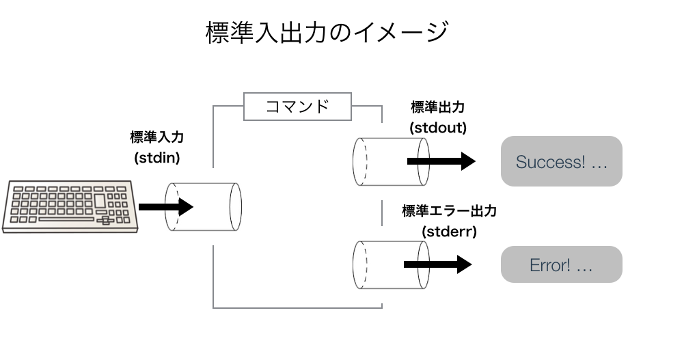
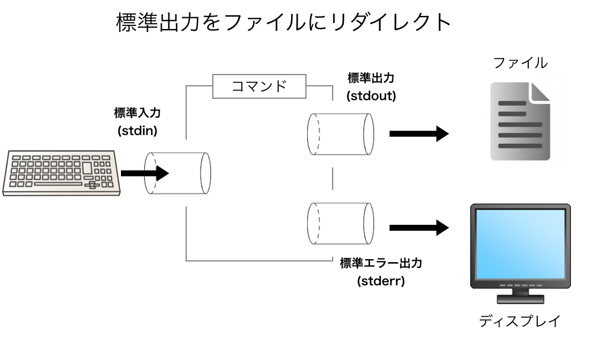
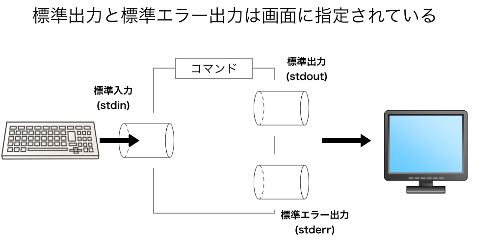
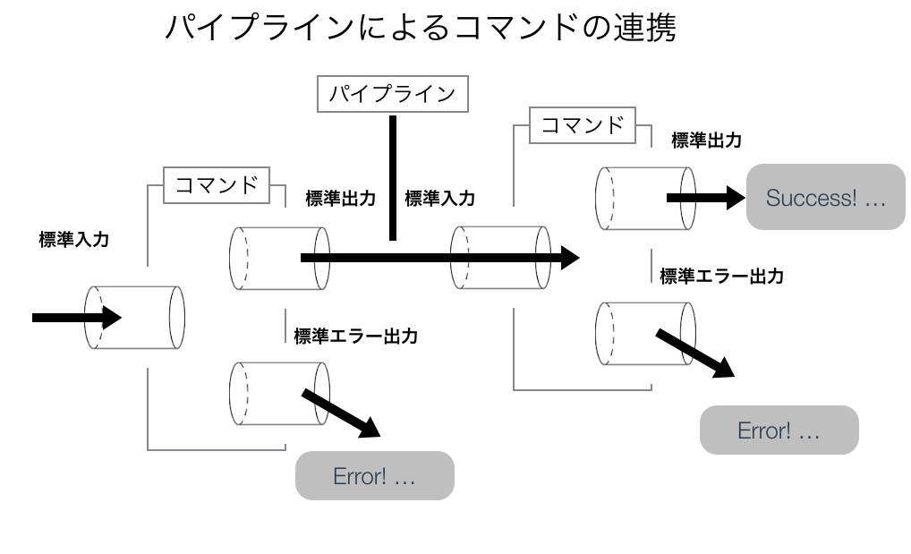

# ファイル操作

## はじめに
今回は下記の4つの項目について扱います。<br>

- ファイル検索(find, locate, 正規表現)
- 標準入出力
- リダイレクトとパイプライン
- フィルタ(grep, sed, head, tail, sort, uniq, wc)

## ファイルの検索
Linuxは全てファイルで管理されているため、ファイル検索は非常によく使います。今回はファイル検索のコマンドとして`find`と`locate`の2種類を紹介します。特に`find`はよく利用するので何度も使ってみて自在に扱えるようにしましょう。


## 準備
検索するための準備として下記のようなディレクトリ構造を準備してください。<br>
以降はすべてfile_operationディレクトリで作業するものとします。<br>

```
- file_operation
    - find_test
        - sample1.txt
        - sample2.txt
        - dir1
            - docs
                - sample1.txt
        - homepage
            - README.md
            - index.html
            - top.html
            - contact.html
            - css
                - style.css
                - reset.css
            - images
                - profile.png
                - icon.png
```


## findコマンド_ディレクトリツリーからのファイル検索
findはその名の通りファイを探すためのコマンドです。他のコマンドと比べるとオプションの付け方がやや難しいので詳しく解説していきます。<br>

### findコマンドの基本
findの基本的な構文は次のとおりです。<br>
オプション(引数)として指定した<検索開始ディレクトリ>を起点として、<検索条件>を満たすファイルを探します。

```bash
$ find <検索開始ディレクトリ> <検索条件>
```

たとえば次の例では**.**(カレントディレクトリ)を起点として「sample1.txt」というファイルを検索しています。その結果、
カレントディレクトリにある「sample1.txt」と「./dir/docs」にある「sample1.txt」の2つのファイルを見つけることができます。<br>
このように、findコマンドでは、指定したディレクトリ直下のファイルだけでなく、**ディレクトリツリー内で検索条件に一致するファイル**を表示することができます。<br>
なお、検索したいファイル名はコーテーション(「'」か「"」)で囲うようにしましょう。

```bash
$ find . -name "sample1.txt"
./dir1/docs/sample1.txt
./sample1.txt
```

### findの検索条件について
findコマンドで利用可能な検索条件は数多く存在しますが、その中でもよく使われる`-name`と`-iname`、`-type`の3種類について紹介します。<br>

### ファイル名で検索する(`-name`と`-iname`)
findコマンドでファイル名を指定して検索するには、検索条件に`-name`もしくは`-iname`を指定します。<br>
`-name`と`-iname`の違いはファイル名の大文字小文字を区別するかどうかという違いがあるだけで他の機能は同一です。`-name`は**大文字小文字を区別します**が、`-iname`は**大文字小文字を区別しません**。<br>
<br>
ファイル名の指定にはワイルドカードとして**\***と**?**を使うことができます。**\***は任意の文字列、**?**は任意の1文字に一致します。<br>
たとえば次の例を実行すると、ファイル名の末尾が「.html」であるファイルを検索します。ワイルドカードを使うときも、コーテーションで囲うようにしましょう。

#### *を使って末尾が「.html」のファイルを検索
```bash
$ find . -name "*.html"
./find_test/homepage/top.html
./find_test/homepage/index.html
./find_test/homepage/contact.html
```

#### ?を使って検索する
```bash
$ find . -name "sample?.txt"
./find_test/dir1/docs/sample1.txt
./find_test/sample1.txt
./find_test/sample2.txt
```

### ファイルの種類で探す(`-type`)
次にファイルの種類で検索してみましょう。`-type <ファイルタイプ`と指定することで、ファイル種別による検索が可能になります。**ファイルタイプ**は次の3種類があります。<br>

#### ファイルタイプ
| 指定方法 | ファイルタイプ |
|:----------:|:----------:|
| -type f | 通常ファイル |
| -type d | ディレクトリ |
| -type l | シンボリックリンク |


#### ディレクトリだけ検索する
```
$ find . -type d
.
./find_test
./find_test/dir1
./find_test/dir1/docs
./find_test/homepage
./find_test/homepage/images
./find_test/homepage/css
```

### 複数条件の指定について
findコマンドを使うときに、複数の検索条件を利用することもできます。次の例では、「通常ファイル」であり、「ファイルが .txt」で終わるファイルを検索しています。このような検索をすると、仮に「sample1.txt」というディレクトリが合っても表示されません。<br>
今回の例だと拡張子があるので、あまり意味がないような印象を受けるかもしれませんが、Linuxにおいては拡張子のないファイルもあるので、ファイルタイプを分けて検索することは意義のあることです。<br>

```bash
$ find . -type f -name "*.txt"
 find . -type f -name "*.txt"
./find_test/dir1/docs/sample1.txt
./find_test/sample1.txt
./find_test/sample2.txt
```

## locateコマンド_ファイル名データベースからのファイル検索
locateコマンドは、パス名の一部を指定してファイルを探すためのコマンドです。パス名の指定を行うので、findコマンドよりも高速な検索が可能となります。<br>

### locateコマンドの準備
Cloud9では最初からlocateコマンドがインストールされていますが、初期状態では、ファイルパス一覧がデータベースに登録されていません。そのため、updatedbコマンドを実行する必要があります。<br>
一度updatedbを実行すれば定期的にデータベースのアップデートが行われるようになります。

```bash
$ sudo updatedb
```

### locateコマンドの基本
locateコマンドの基本的な構文は次のとおりです。<br>

```bash
$ locate [オプション] <検索パターン>
```

### locateコマンドを実行してみる
```bash
$ locate bash
```

### locateのオプションについて
#### ワイルドカード指定
findと同じようにワイルドカードが使えます。<br>

```bash
$ locate "*.sh"
```

#### 大文字と小文字を区別しない
`-i`または`--ignore-case`を利用すると、大文字と小文字を区別せずに検索できます。<br>

```bash
$ locate -i readme
```

#### ファイル名だけを対象に検索
`-b`をつけるとファイル名だけを検索対象にすることができます。<br>
下記の例では、**ファイル名に「ruby」とつくもの**だけを検索しています。通常のlocateでは、検索パターンがファイルパスのどこかに含まれていれば検索に一致したものと判断されます。例えば、`/usr/local/rvm/src/rvm/patchsets/ruby/head`のようなものも表示されます。<br>
そこで`-b`を利用すると、ファイル名そのものに含まれた場合のみを検索することができます。

```bash
$ locate -b ruby
```

#### AND検索
`-A`を利用して、複数の検索パターンを並べればAND検索になります。<br>

```bash
$ locate -A bash doc
```

#### OR検索
複数の検索パターンを並べればOR検索になります。<br>

```bash
$ locate docs document
```

### findとlocateの違い
下記のそれぞれのコマンドは等価ですが、一般にはlocateの方がfindよりも高速に動作します。

```bash
$ find / -name '*filename*'
$ locate filename
```

findコマンドはコマンドを打つたびにファイル階層を検索し直すため、検索に時間がかかります。一方、locateコマンドとは、データベースを作成し、それに基づいて検索を行うのでより高速な検索が可能となります。<br>


### locateの使い所
検索の速度で言えば、locateの方がfindよりも優れていますが、ファイルのデータベース更新が必要なため、次のような状況があり得ることに注意しないといけません。<br>
<br>

- locateコマンドで表示されたファイルが実際にはディスク上に存在しない
- locateコマンドでは表示されないので、ディスク上にファイルが存在する

<br>
例としては、今作成したばかりファイルはデータベースには入っていないため、locateコマンドで見つけることは出来ません。このため、locateコマンドは作成してから時間が経過しているファイルを探すのに向いています。


## コマンド間の連携
http://qiita.com/mohira/private/c17393c07ff55cba2c9f#%E6%A8%99%E6%BA%96%E5%85%A5%E5%87%BA%E5%8A%9B
これからコマンドの連携させる方法を学習していきますが、その前にどういう仕組みでコマンド間の情報をやりとりしているのかについて説明します。<br>

## 標準入出力(標準入力と標準出力)
### 標準入出力とは
Linux(UNIX)のコマンドは色々ありますが、多くのコマンドが共通してもつ機能として、入力値としてデータをもらい、処理した結果をどこかに返す。そのためにコマンドはどこかから処理するためのデータを受け付けて、結果として出力を返す必要があります。<br>
<br>
こういったコマンドのデータ受け渡しについては、Linuxのシステム全体としてあらかじめ決められた仕組みがあります。これが**標準入出力**です。<br>
標準入出力には下記の3種類があります。<br>

| 種類 | デフォルト |
|------|------------|
| 標準入力(stdin)        | キーボード |
| 標準出力(stdout)       | 画面 |
| 標準エラー出力(stderr) | 画面 |

Linuxのコマンドは入力を「標準入力から受け付けて」、その結果を「標準出力」に出力します。もし、エラーが起きた場合は、「標準エラー出力に」エラー内容を出力します。<br>
<br>
それぞれのコマンドは「キーボードから入力されている」とか「画面に出力す」というように捉えているのではなく、単純に**標準入力から入力し、標準出力に出力する**だけです。<br>
<br>
標準入力は通常はキーボードが割り当てられいますが、ファイルでも問題ありません。標準出力は通常は画面(cloud9のターミナル)に割り当てられていますが、ファイルに出力したり、プリンタに出力してもかまわないのです。<br>



## catコマンドで標準入出力を考える
では、実際にcatコマンドを、標準入出力の観点からみてみましょう。例えば、下記のようなテキストファイルがあるとします。<br>

```
// sample1.txt
hello
```

```
// sample2.txt
world
```

### catコマンドの基本的な使い方(復習)
catコマンドは引数としてファイル名を指定するとそのファイルの内容を出力します。複数のファイル名を渡すとつなげて出力します。<br>

```bash
$ cat sample1.txt
hello
$ cat sample2.txt
world
$ cat sample1.txt sample2.txt
hello
world
```

### catコマンドを引数なしで実行する
catコマンドを標準入出力の観点から説明すると「ファイルの中身を出力する」というのは不十分です。実際には、「標準入力から入力された文字列を改行コードを区切りとして標準出力に出力する」という説明になります。<br>
<br>
catコマンドをファイル名指定をせずに実行すると、標準入力の内容を出力します。下記の例をみてみましょう。これは、catコマンドが、キーボード(標準入力)から入力された文字列を入力として、ターミナル(標準出力)に出力していることになります。<br>


```bash
$ cat
hello    ### ← キーボードからhelloと入力
hello    ### ← helloと表示された
         ### ← Control + d を入力
$        ### ← もとに戻った
```

## リダイレクト
上記の例では、catコマンドで引数にファイル名を渡さず実行すると、標準入力であるキーボードから受け取った文字列を、標準出力の画面に返すということがわかりました。<br>
この標準入力と標準出力は変更することができます。例えば、標準入力を特定のファイルにしたり、標準出力を画面ではなく、別のファイルや別のコマンドに渡すことができます。<br>
このために用意されている機能がリダイレクトとパイプラインです。<br>

### 標準入力へのリダイレクト
下記のコマンドを実行してみましょう。<br>
これを実行すると`/etc/crontab`の内容が画面に出力されます。「<」を利用することによって、標準入力をファイルに切り替えたわけです。これを**入力リダイレクト**と呼びます。<br>

```bash
$ cat < /etc/crontab
# /etc/crontab: system-wide crontab
# Unlike any other crontab you don't have to run the `crontab'
# command to install the new version when you edit this file
# and files in /etc/cron.d. These files also have username fields,
# that none of the other crontabs do.

SHELL=/bin/sh
PATH=/usr/local/sbin:/usr/local/bin:/sbin:/bin:/usr/sbin:/usr/bin
# m h dom mon dow user  command
17 *    * * *   root    cd / && run-parts --report /etc/cron.hourly25 6    * * *   root    test -x /usr/sbin/anacron || ( cd / && run-parts --report /etc/cron.daily )
47 6    * * 7   root    test -x /usr/sbin/anacron || ( cd / && run-parts --report /etc/cron.weekly )
52 6    1 * *   root    test -x /usr/sbin/anacron || ( cd / && run-parts --report /etc/cron.monthly )
#
```

### 標準出力へのリダイレクト
標準出力の変更もリダイレクトによって実現できます。よくあるパターンとしては、**コマンドの実行結果を画面に表示するのではなく、ファイルに保存したい**というときです。標準出力の変更には「>」を使います。2つの例をみてみましょう。<br>

#### lsの出力結果をファイルに保存する
`ls -l /`によってルートディレクトリのファイル一覧を出力できますが、リダイレクトを使うことによって、標準出力を`list.txt`というファイルに変更しています。標準出力を変更しているので、画面には何も出力されません。<br>
コマンド実行号は`list.txt`を確認してみましょう。`ls -l /`の結果が記録されているはずです。なお、このときに指定するファイルは存在してなくても問題ありません。<br>

```bash
$ ls -l / > list.txt
```



#### 引数なしcatコマンドで入力した内容をファイルに保存する
もう一つ例をみてみましょう。catコマンドを引数なしで実行した場合、通常は入力した内容がすぐさま表示されますが、下記のように実行すると、`input.txt`に「line1」「line2」「line3」が記録されます。<br>

```bash
$ cat > input.txt
line1 ### ← キーボードから line1 と入力
line2 ### ← キーボードから line2 と入力
line3 ### ← キーボードから line3 と入力
      ### ← キーボードから Control + d を入力
```

### 標準エラー出力を切り替える
通常は、標準出力と標準エラー出力は同じ画面が割り当てられいるため、コマンドを実行した後に画面出力されるメッセージが標準出力のものか、標準エラー出力のものかを区別することはできません。<br>




そのため、下記のようなコマンドを実行しても画面にはメッセージが表示されます。これは、標準出力と標準エラー出力が別々のチャネルになっているからです。<br>
標準出力はファイルにリダイレクトしましたが、標準エラー出力は変更していないので、エラーメッセージはそのまま出力されます。この仕組みがあるおかげで、標準出力をファイルにリダイレクトさせても、エラーメッセージは標準エラー出力に表示されるので見落としを防げます。<br>

```bash
$ ls hogehoge > hoge.txt
ls: cannot access hogehoge: No such file or directory
```

#### 標準エラー出力のリダイレクト
標準エラー出力のリダイレクトは「2>」という記号を使います。<br>
エラーメッセージを`error.txt`にリダイレクトさせて、`error.txt`中身をみてみましょう。<br>

```
$ ls hogehoge 2> error.txt
$ cat error.txt
ls: cannot access hogehoge: No such file or directory
```


## パイプライン
パイプライン(「パイプ」と呼ばれることも多いです)とは、簡単に言えば、コマンドを連携させるための仕組みです。<br>
例えば、lsコマンドを実行したときに、ファイルがたくさんありすぎて表示結果が1画面に収まりきらないことがあります。こういうときは、lsコマンドの結果を別ファイルにリダイレクトさせ、その後、lessコマンドを使ってコマンドの結果を閲覧するという方法があります。<br>

```bash
$ ls -l / > temp_list.txt
$ less temp_list.txt
```

しかし、このようにいちいち中間ファイル(上記例では「temp_list.txt」)を作るのはあまり賢いとは言えないでしょう。そこで、中間ファイルを生成せずに1つのコマンドの結果を別のコマンドに渡して、コマンドを連携することができればよりスマートです。そのための機能がパイプラインです。<br>
今回の例で言えば、**lsの出力結果をlessの引数として使う**ということになります。<br>



#### パイプラインの構文
構文は次のとおりです。<br>
パイプラインは複数重ねることが可能です。<br>

```bash
$ <コマンド> | <コマンド> [| <コマンド> ...]
```

#### lsの出力結果をファイルにリダイレクトしてlessで確認する
では、パイプラインを利用してコマンドの連携をさせてみましょう。先程は2回に分けていましたが、下記のように1行で書くことができます。<br>

```bash
$ ls -l / | less
```

#### コマンドの履歴をlessで確認する
もう一つの例としてhistoryコマンドで出力されるコマンド実行履歴をlessで確認してみましょう。<br>


```bash
$ history | less
```

## フィルタ
Linuxでは、catコマンドのように、**標準入力を入力として受け取り、標準出力に出力する**というコマンドが数多くあります。このようなコマンドを**フィルタ**と呼びます。

### フィルタコマンドとは

| コマンド | 働き |
|:---------:|:---------:|
| grep | 指定した検索パターンに一致する行だけを表示 |
| sed  | ??? |
| head | 先頭部分を表示 |
| tail | 末尾部分を表示 |
| sort | 順序の並べ替え |
| uniq | 重複の除去 |
| wc   | 行数やバイト数を表示 |


### フィルタコマンドの例
では、例として、`head`コマンドを試してみましょう。
これはファイル内容の先頭の10行だけを表示するコマンドです。<br>

```
$ head /etc/crontab
# /etc/crontab: system-wide crontab
# Unlike any other crontab you don't have to run the `crontab'
# command to install the new version when you edit this file
# and files in /etc/cron.d. These files also have username fields,
# that none of the other crontabs do.

SHELL=/bin/sh
PATH=/usr/local/sbin:/usr/local/bin:/sbin:/bin:/usr/sbin:/usr/bin

# m h dom mon dow user  command
```

headコマンドは特に何も指定しなければ、標準入力が入力として使用されます。そのため、パイプラインを利用して、headコマンドをhistoryコマンドと組み合わせることができます。実行してみるとhistoryコマンドで表示する履歴を10行にすることができます。<br>

```bash
$ history | head
    1  ls
    2  mkdir sample
    3  cd sample/
    4  ls
    5  ls -l
    6  touch sample1.txt
    7  touch sample2.txt
    8  touch sample3.txt
    9  mkdir test
   10  cd test
```

## フィルタの確認と準備
では、フィルタをいくつか試してみましょう。試すにあたってサンプルファイルがを準備します。<br>
下記のファイルを`fruits.sh`として保存して次のコマンドを実行してください。`fruits.txt`というファイルに300行のデータが入るはずです。<br>

```
#!/usr/bin/perl

@list = ('apple','banana','cherry','grape','peach');
$bar = @list;
for ($i = 0; $i < 300; $i++) {
    $num = int(rand($bar));
    print "$list[$num]\n";
}
```

```bash
$ chmod 755 fruits.sh
$ ./fruits.sh > fruits.txt
```


### tail
tailは末尾を部分表示するフィルタです。デフォルトでは10行になっています。<br>

```bash
$ history | tail
```

### sort
次のコマンドを実行するとアルファベット順にソートされたものをlessで確認できます(apple banana cherry grape peach の順序)。

```
$ sort fruits.txt | less
```

### uniq
uniqを使うと重複を除去できます。さらに、sortと組み合わせることによって、行の種類の一覧を作ることができます。<br>

```bash
$ sort fruits.txt | uniq
apple
banana
cherry
grape
peach
```

### wc
wcコマンドは入力されてきたテキストの文字数や行数をカウントするコマンドです。wc -lで入力されたテキストの行数をカウントします。<br>

```bash
$ wc -l fruits.txt
300 fruits.txt
```

## 【WIP】sed


## grep
ファイルの中身から特定の文字列を検索したいことがあります。そのときに便利なのがgrepです。grepコマンドのあとに検索したいキーワード。そのあと、対象のファイルを指定します。<br>

### grepの構文
```bash
$ grep [オプション] <検索パターン> <ファイル名>
```

### grepの準備
下記のテキストファイルを利用します。<br>

```
姓 名 メールアドレス 性別 年齢 住所 年収(万円) 電話番号
木村 悠真 ghunter@yamia.info female 54 宮崎県高崎市宝町7010-1 4980 7-(594)192-0808
岡本 響 dturner@layo.biz female 64 和歌山県太田市富士見町4376-8 9980 3-(057)121-6667
小山 優奈 jgriffin@ntags.gov male 23 新潟県那須塩原市松坂町0785-1 9980 9-(417)725-1300
酒井 陽斗 dbrown@topicstorm.mil male 52 秋田県常陸太田市相原町9307-6 1980 3-(081)883-7415
原田 楓 awilliamson@zoombox.org male 27 京都府沼田市広小路9733-2 8980 6-(219)176-8374
岡田 茜 rgraham@skinder.mil female 32 滋賀県伊勢崎市西境町7-7-2 2980 7-(495)495-4969
新井 美咲 hlee@zoovu.name male 67 石川県伊勢崎市東境町9294-0 8980 0-(500)241-7312
宮崎 陽菜 rreed@trudeo.name male 61 青森県多野郡上野村港町0018-0 7980 6-(114)799-0162
藤井 裕子 ahunt@jabbersphere.name male 55 大分県焼津市広小路8830-1 8980 1-(735)349-7747
菊地 さくら smartinez@bubblebox.net female 39 岐阜県静岡市葵区宝町0-6-3 5980 7-(883)944-6641
谷口 さくら jpierce@browsebug.org male 29 北海道御殿場市高倉町3-8-9 4980 3-(626)134-0084
斎藤 大地 awallace@photobug.net female 40 群馬県長岡市寿町8-3-1 5980 6-(039)538-2861
青木 美咲 jvasquez@wordpedia.name female 65 福井県館林市宝町0-6-4 7980 1-(302)135-9750
池田 彩 rporter@agimba.net male 72 京都府桐生市三田町4-0-2 7980 9-(130)440-0627
松本 奏太 clawrence@demimbu.info male 40 沖縄県岩船郡高倉町7-5-6 3980 4-(085)631-3692
佐藤 杏奈 brodriguez@linklinks.biz female 65 長崎県安中市高倉町6-8-3 9980 7-(809)677-7495
内田 大樹 egibson@trupe.name male 33 富山県小山市半城土町0-7-1 5980 4-(302)460-4443
高田 優菜 wkelley@chatterbridge.name female 32 佐賀県高崎市新富町7-9-5 5980 6-(030)041-1722
村上 航 rburton@skynoodle.gov male 66 鳥取県多野郡上野村八幡町8-4-6 5980 8-(487)849-0696
村田 陸 hhill@mynte.info male 70 埼玉県桐生市松坂町5525-9 8980 6-(536)090-3088
増田 海斗 rdavis@eabox.org male 70 兵庫県島田市山池町2873-4 4980 3-(844)389-1690
小川 諒 jturner@thoughtbridge.gov female 68 群馬県多野郡上野村港町8-0-8 8980 9-(705)951-4770
林 大翔 wperez@topicstorm.mil male 46 山口県鉾田市金山町1-4-2 7980 5-(789)417-5324
西村 大輝 bharris@babbleopia.edu female 75 静岡県東蒲原郡富士見町2016-6 3980 9-(306)373-1457
松井 美優 rford@divape.com male 46 長崎県静岡市葵区南沖野町1177-4 8980 8-(806)082-8713
小野 優斗 pgutierrez@zoomdog.net female 57 神奈川県裾野市八幡町3905-8 5980 6-(063)205-4789
小川 亮太 rfuller@skipstorm.biz female 53 新潟県富士市天王町2-4-8 8980 4-(940)576-6796
山本 結衣 pkennedy@vidoo.biz female 43 広島県裾野市丸田町5-2-0 1980 7-(888)352-6423
宮崎 さくら chall@kaymbo.info male 56 福岡県静岡市葵区相原町3-1-1 2980 7-(978)837-3024
中野 陽 thunter@abata.org male 68 山口県桐生市港町2545-2 3980 1-(190)310-3014
池田 美緒 shamilton@roombo.net female 77 大阪府ひたちなか市寿町3-1-7 2980 9-(693)359-6610
吉田 亮 pwillis@dynazzy.mil female 28 茨城県熱海市荒井町6-4-9 1980 7-(812)306-1318
伊藤 翔太 lmorgan@bubblebox.biz female 37 新潟県さくら市熊野町9917-3 4980 6-(659)069-7513
丸山 誠 rward@photobug.edu male 27 宮城県掛川市御幸町7759-0 4980 9-(007)300-8992
山崎 大和 scole@aimbo.com male 54 岩手県富士市野田新町8297-5 8980 2-(166)097-0078
工藤 陽子 erichardson@twitterbeat.org female 46 新潟県糸魚川市三田町9971-8 8980 0-(070)710-9371
岡本 颯 jjacobs@yacero.org female 70 愛媛県ひたちなか市高倉町8927-4 6980 7-(981)036-1519
安藤 美緒 fblack@devify.info female 68 群馬県伊東市松栄町7510-7 9980 4-(982)627-8706
山崎 真央 hday@meetz.org female 48 福島県掛川市松栄町5-4-6 7980 6-(800)322-5743
内田 大輝 sday@brainbox.info female 55 茨城県三条市相原町0-8-0 7980 1-(405)590-8070
森 桜 gharrison@linklinks.name male 22 福岡県矢板市野田新町1908-5 2980 2-(085)153-4099
清水 杏 mriley@jayo.gov female 42 福井県大田原市南桜町1-4-4 8980 3-(419)432-3387
丸山 大翔 ewelch@chatterbridge.net male 23 東京都新宿区西境町2799-1 9980 4-(114)559-8857
加藤 杏 sryan@devpoint.edu female 30 京都府藤岡市御幸町6-8-8 8980 0-(173)438-4560
村田 未来 aholmes@dabfeed.org male 52 島根県桐生市御幸町2343-8 9980 6-(335)849-4575
柴田 優斗 tturner@dynava.net female 67 群馬県糸魚川市三田町1773-3 7980 0-(639)552-2773
長谷川 瑛太 rhunt@innotype.gov male 36 愛知県沼津市中島町9-6-6 3980 7-(003)191-5922
山下 智子 tdaniels@flipbug.org female 29 新潟県渋川市松坂町7417-0 3980 8-(805)372-9797
野村 颯太 rmartin@voonder.info male 58 佐賀県佐波郡玉村町金山町2-2-4 2980 2-(785)741-1864
井上 海斗 jbaker@flashdog.mil female 49 富山県前橋市半城土町3090-0 7980 9-(191)912-5109
田中 誠 ablack@thoughtstorm.biz female 33 沖縄県焼津市東境町1925-2 8980 7-(178)253-2713
藤井 結 jaustin@kwinu.com female 26 茨城県富岡市松坂町5838-3 8980 4-(846)608-9041
岡本 舞 dburns@feednation.mil female 25 熊本県利根郡片品村大手町8370-9 2980 8-(293)768-9996
田中 翼 nfoster@photojam.gov female 60 広島県多野郡上野村荒井町0-4-6 4980 3-(628)045-1398
佐藤 花音 gcarter@zooxo.mil female 25 宮崎県糸魚川市広小路7-8-0 1980 5-(474)739-6137
中山 陽菜 ablack@blogspan.org female 57 岡山県さくら市宝町2-0-7 3980 2-(238)472-2633
吉田 明日香 lowens@buzzster.info female 68 佐賀県太田市大手町4310-2 2980 4-(844)362-4013
菅原 大和 tross@blogpad.name female 36 埼玉県柏崎市松栄町9754-9 3980 3-(312)503-2103
竹内 翔 aperry@brainlounge.net female 63 徳島県佐波郡玉村町三田町5334-5 3980 9-(121)966-7521
阿部 遼 rhayes@meevee.gov female 40 沖縄県那須烏山市大手町0-4-2 3980 9-(855)279-6971
原 美緒 dclark@bubblebox.gov male 25 大阪府那須塩原市金山町4-5-0 1980 0-(545)775-8827
太田 優花 pbaker@youtags.org male 26 岡山県吾妻郡中之条町港町7138-2 1980 2-(809)135-9706
佐々木 瑛太 arose@yombu.gov male 49 石川県静岡市葵区恩田町6443-3 1980 9-(892)190-1369
中山 優 msmith@vitz.biz female 25 徳島県新宿区三田町7331-0 2980 8-(625)972-7251
高木 航 bbrown@photospace.name male 80 神奈川県桐生市相原町4-6-0 3980 3-(007)437-7708
前田 彩乃 aperkins@brainverse.org male 31 秋田県多野郡上野村天王町3457-0 7980 8-(712)747-9685
渡部 彩花 rwells@jaxnation.biz female 20 山形県桐生市新富町8-1-8 2980 4-(895)353-1346
宮崎 翔太 jduncan@demimbu.org male 64 山形県御殿場市野田新町1104-3 9980 6-(379)888-6919
柴田 杏 srussell@jetwire.com female 62 滋賀県下野市半城土町9761-7 5980 4-(752)424-1007
野村 美緒 jblack@trilia.org female 73 愛知県富士宮市三田町7758-1 2980 1-(548)408-1457
佐藤 翔太 bwells@twitterlist.edu female 34 和歌山県掛川市矢場町0-9-8 6980 5-(499)899-3386
柴田 仁 wgutierrez@jaxspan.gov male 38 神奈川県岩船郡三田町9428-1 6980 2-(399)649-1841
石川 舞 kdixon@thoughtstorm.net male 55 大阪府柏崎市南桜町9-8-5 2980 9-(516)659-0468
斎藤 陸 dcoleman@realcube.org female 68 京都府静岡市葵区天王町7634-9 7980 4-(334)182-0230
宮崎 一郎 ehicks@skiba.com male 59 茨城県甘楽郡下仁田町三田町5721-2 3980 2-(092)090-3803
西村 奈々 jpatterson@aimbu.gov female 36 埼玉県高崎市宝町6-6-9 1980 0-(367)645-2218
柴田 颯 cpowell@aimbu.info male 44 山口県常陸太田市富士見町5305-5 1980 4-(522)496-8675
大野 遼 mrivera@blogspan.mil female 65 滋賀県小山市南沖野町1658-5 5980 5-(691)471-5637
田村 愛 smorris@cogilith.info male 75 高知県常陸太田市八幡町9-0-5 2980 2-(279)049-6931
松尾 優菜 whill@mydeo.com male 80 岩手県佐波郡玉村町八幡町1411-5 1980 1-(229)598-1123
木下 奏太 bboyd@zooxo.mil female 48 熊本県島田市南桜町1184-4 7980 3-(636)614-0798
阿部 凛 acampbell@feednation.info male 52 宮崎県富士市広小路0692-1 5980 7-(776)619-5554
野村 優 mchavez@blogpad.biz male 37 鳥取県磐田市中島町1-3-4 3980 0-(838)566-4867
村上 悠真 tsnyder@yombu.org female 23 滋賀県館林市金山町7-8-4 4980 0-(810)994-8963
石田 千尋 bmartinez@jayo.info male 53 和歌山県富岡市寿町8304-0 9980 5-(698)132-5694
田村 一輝 emason@voonyx.gov male 64 高知県多野郡上野村高倉町5-2-6 4980 4-(642)243-8080
鈴木 彩花 acox@camimbo.edu female 59 和歌山県龍ヶ崎市荒井町4-9-4 2980 4-(460)339-5345
中村 颯 acarroll@agivu.com male 53 愛知県上都賀郡西方町矢場町5-2-0 1980 0-(134)881-9098
武田 駿 pphillips@eazzy.biz female 64 京都府上都賀郡西方町高倉町2-3-0 3980 0-(828)415-8206
池田 楓 sdaniels@shufflester.mil male 24 静岡県前橋市中島町5781-6 1980 2-(104)250-0315
斉藤 茜 estephens@plajo.gov female 62 千葉県太田市天王町4-4-6 4980 7-(450)141-0467
松尾 拓海 ealexander@livetube.edu female 42 岩手県ひたちなか市南沖野町2-7-7 3980 7-(847)608-9864
内田 健太 wsnyder@yabox.net male 28 徳島県小山市金山町9751-7 7980 1-(790)631-8911
森 琴音 cellis@yozio.name female 74 静岡県藤枝市矢場町9155-2 4980 4-(223)564-9070
宮崎 葵 hreed@jayo.biz male 41 岡山県三島市天王町8-6-1 1980 0-(322)190-1267
石田 樹 tjohnston@skiptube.org male 45 京都府新潟市北区高倉町8953-7 3980 8-(911)182-5753
斉藤 千尋 jlarson@wordpedia.edu female 76 大分県下野市相原町9-0-5 9980 2-(427)470-7192
池田 優奈 gsimmons@realcube.gov female 75 岩手県上都賀郡西方町新富町3-9-8 9980 3-(982)656-5782
田村 大樹 chawkins@zoombox.biz female 39 大分県富士市御幸町6-9-6 5980 0-(440)314-9039
野村 蓮 joliver@yozio.net male 56 福岡県御殿場市寿町4-0-1 9980 6-(946)503-0043
```


### grepを使ってみる
サンプルファイルaddress.txtで"さくら"という文字が含まれるデータを検索してみましょう。<br>

```bash
$ grep "さくら"" address.txt
11:菊地 さくら smartinez@bubblebox.net female 39 岐阜県静岡市葵区宝町0-6-3 5980 7-(883)944-6641
12:谷口 さくら jpierce@browsebug.org male 29 北海道御殿場市高倉町3-8-9 4980 3-(626)134-0084
30:宮崎 さくら chall@kaymbo.info male 56 福岡県静岡市葵区相原町3-1-1 2980 7-(978)837-3024
34:伊藤 翔太 lmorgan@bubblebox.biz female 37 新潟県さくら市熊野町9917-3 4980 6-(659)069-7513
57:中山 陽菜 ablack@blogspan.org female 57 岡山県さくら市宝町2-0-7 3980 2-(238)472-2633
```


| オプション | 機能 |
|------------|------|
| -i | 大文字と小文字を区別しない |
| -n | 行番号の表示 |
| -v | 検索パターンに一致しない行を出力 |

※Cloud9では `grep='grep --color=auto'` というエイリアスがデフォルトで割り当てられています。<br>

### 正規表現
grepコマンドでは通常の文字列以外に正規表現という検索パターンを指定することができます。実際のシーンを考えると、検索パターンは固定の文字列だけではなく、「◯◯という文字で始まる行」や「アルファベットだけで構成されている行」といったパターンもあるはずです。このような検索をするときに**条件に合致する文字列集合を表現するための記法**が正規表現です。<br>
<br>
正規表現は非常に奥が深いので参考程度にしておきます。そのため、現時点では「あるパターンを正規表現でどのように記述するかをマスターする」ということではなく、「正規表現を使うと色々な条件で検索ができる」ということを認識する程度でOKです。<br>
では、いくつかの例を紹介します。<br>


#### 【WIP】正規表現の例をいくつか書いておきたい
